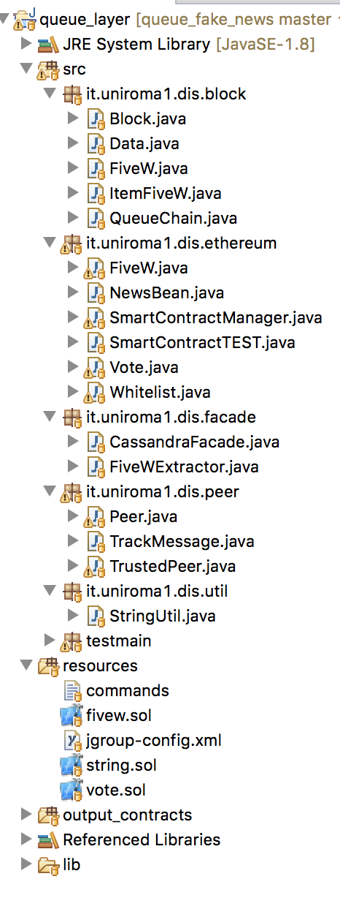

# Fake News & Blockchain

A 2L+ blockchain dealing with fake news' problem

## Structure

Under “src” folder we have five main packages and one just for testing the whole architecture:

*	Block : Blockchain structure and data-mapping for meta-info.
*	Peer : Peer structure and method to be invoked for implementing the “Zyzzyva lucky case” with the help of TrackMessage, that is just a message encapsulation. We have the TrustedPeer instead that is whitelisted and may interact with the second smart contract (the private one)
*	Util : Common operations such as conversion of string to byte.
*	Façade : It integrates the external modules’ interfaces, or better the python module concerning with the 5w extraction and the Cassandra driver for POST/GET operations.
*	Ethereum : This package describe the java classes that represent the smart contracts deployed on Ethereum Blockchain (public and private one). We have even a test class, a manager that can be invoked by peers to call smart contracts’ interfaces and a bean representing the main fields of the news structure defined on the smart contract.

The “resources” folder contain the two smart contract (fivew public, vote private) and another one used as util dependency dealing with strings. The output of the compiled smart contracts is in “output_contracts” folder. In resources we have also a configuration file for the jgroup library used by peers for exchanging messages and a set of commands for compiling the smart contracts and generating the java interface classes.
